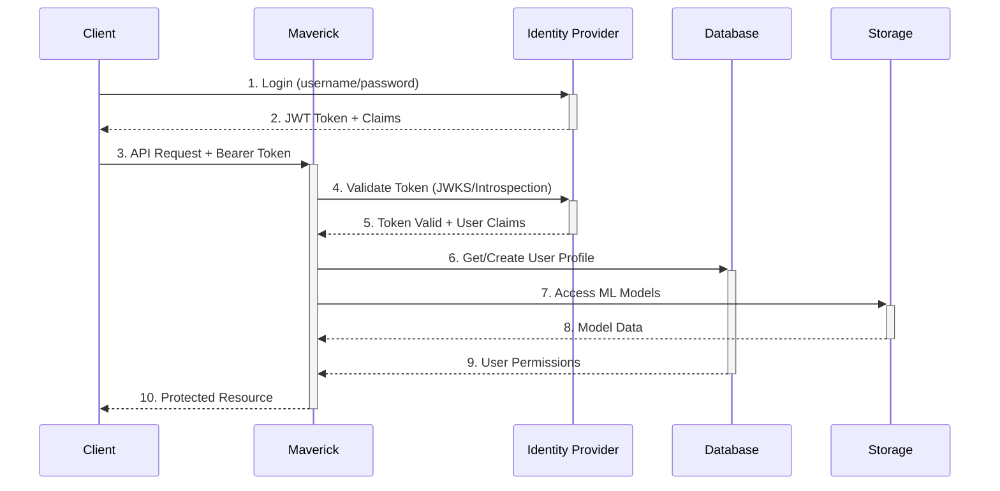

# 🔌 Maverick Platform - Integrazione Provider Esterni

Guida completa per integrare Maverick con **Identity Provider (IdP) esterni** e **storage alternativi** a MinIO.

## 📋 Indice

- [🔐 Identity Provider Esterni](#identity-provider)
- [☁️ Storage Provider Alternativi](#storage-provider)
- [🏗️ Architettura Hybrid](#architettura-hybrid)
- [⚙️ Configurazione](#configurazione)
- [🚀 Implementazione](#implementazione)
- [🧪 Testing](#testing)
- [🔧 Troubleshooting](#troubleshooting)

---

## 🔐 Identity Provider Esterni {#identity-provider}

### **Opzioni Supportate**

#### **1. Keycloak** (Raccomandato)
- **Pro**: Open source, enterprise-ready, completa gestione utenti
- **Flusso**: OAuth 2.0 / OpenID Connect
- **Token**: JWT standard
- **Integrazione**: Nativa con Spring Security

#### **2. Auth0**
- **Pro**: SaaS managed, facile setup, multi-tenant
- **Flusso**: OAuth 2.0 / OpenID Connect
- **Token**: JWT standard
- **Integrazione**: REST API + Spring Security

#### **3. Azure AD (Entra ID)**
- **Pro**: Integrazione Microsoft, enterprise features
- **Flusso**: OAuth 2.0 / OpenID Connect
- **Token**: JWT standard
- **Integrazione**: Spring Boot Starter

#### **4. Google Cloud Identity**
- **Pro**: Integrazione Google Workspace
- **Flusso**: OAuth 2.0 / OpenID Connect
- **Token**: JWT standard
- **Integrazione**: Google Auth Library

#### **5. AWS Cognito**
- **Pro**: Integrazione AWS, scalabilità automatica
- **Flusso**: OAuth 2.0 / OpenID Connect
- **Token**: JWT standard
- **Integrazione**: AWS SDK + Spring Security

### **Architettura con IdP Esterno**



---

## ☁️ Storage Provider Alternativi {#storage-provider}

### **Opzioni Supportate**

#### **1. AWS S3**
- **Pro**: Scalabilità infinita, performance eccellenti, servizi integrati
- **Configurazione**: AWS SDK + Spring Boot
- **Costi**: Pay-per-use, ottimizzazione tier automatica
- **Sicurezza**: IAM roles, encryption at rest/transit

#### **2. Google Cloud Storage**
- **Pro**: Integrazione ML APIs, BigQuery, AI Platform
- **Configurazione**: Google Cloud SDK
- **Costi**: Competitive pricing, nearline/coldline storage
- **Sicurezza**: IAM, Cloud KMS encryption

#### **3. Azure Blob Storage**
- **Pro**: Integrazione Azure ML, Cognitive Services
- **Configurazione**: Azure SDK + Spring Boot
- **Costi**: Hot/Cool/Archive tiers
- **Sicurezza**: Azure AD, managed identities

#### **4. Oracle Cloud Object Storage**
- **Pro**: Enterprise features, autonomous database integration
- **Configurazione**: OCI SDK
- **Costi**: Competitive, no egress charges
- **Sicurezza**: Identity and Access Management

#### **5. IBM Cloud Object Storage**
- **Pro**: Watson AI integration, enterprise support
- **Configurazione**: IBM Cloud SDK
- **Costi**: Flexible pricing models
- **Sicurezza**: Key Protect, Activity Tracker

### **Confronto Storage Providers**

| Provider | Costo/GB/mese | Trasferimento | AI Integration | Enterprise |
|----------|---------------|---------------|----------------|------------|
| **AWS S3** | $0.023 | $0.09/GB | ✅ SageMaker | ✅ Excellent |
| **Google Cloud** | $0.020 | $0.12/GB | ✅ AI Platform | ✅ Very Good |
| **Azure Blob** | $0.018 | $0.087/GB | ✅ ML Studio | ✅ Excellent |
| **Oracle Cloud** | $0.025 | FREE | ⚠️ Limited | ✅ Very Good |
| **IBM Cloud** | $0.023 | $0.09/GB | ✅ Watson | ✅ Good |
| **MinIO** | Hosting cost | FREE | ❌ None | ⚠️ Self-managed |

---

## 🏗️ Architettura Hybrid {#architettura-hybrid}

### **Scenario 1: Keycloak + AWS S3**
```yaml
# Architettura Enterprise Classica
Identity: Keycloak (On-premise/Cloud)
Storage: AWS S3 (Multi-region)
Database: PostgreSQL (RDS)
Application: Maverick (EKS/EC2)
```

### **Scenario 2: Azure AD + Azure Blob**
```yaml
# Architettura Microsoft-centric
Identity: Azure AD (Entra ID)
Storage: Azure Blob Storage
Database: Azure Database for PostgreSQL
Application: Maverick (Azure Container Instances)
```

### **Scenario 3: Auth0 + Multi-Cloud**
```yaml
# Architettura SaaS-first
Identity: Auth0 (SaaS)
Storage: AWS S3 (primary) + Google Cloud (backup)
Database: AWS RDS PostgreSQL
Application: Maverick (Multi-cloud deployment)
```

---

## ⚙️ Configurazione {#configurazione}

### **1. Configurazione Keycloak**

#### **application.properties**
```properties
# Keycloak Configuration
spring.security.oauth2.resourceserver.jwt.issuer-uri=https://keycloak.company.com/auth/realms/maverick
spring.security.oauth2.resourceserver.jwt.jwk-set-uri=https://keycloak.company.com/auth/realms/maverick/protocol/openid_connect/certs

# JWT Processing
maverick.security.provider=keycloak
maverick.security.keycloak.realm=maverick
maverick.security.keycloak.client-id=maverick-backend
maverick.security.keycloak.client-secret=${KEYCLOAK_CLIENT_SECRET}
maverick.security.keycloak.server-url=https://keycloak.company.com/auth

# User Role Mapping
maverick.security.keycloak.role-mapping.admin=maverick-admin
maverick.security.keycloak.role-mapping.predictor=maverick-predictor
maverick.security.keycloak.role-mapping.viewer=maverick-viewer
```

#### **Keycloak Realm Configuration**
```json
{
  "realm": "maverick",
  "enabled": true,
  "clients": [{
    "clientId": "maverick-backend",
    "enabled": true,
    "clientAuthenticatorType": "client-secret",
    "secret": "your-client-secret",
    "standardFlowEnabled": true,
    "serviceAccountsEnabled": true,
    "authorizationServicesEnabled": true,
    "directAccessGrantsEnabled": true,
    "webOrigins": ["https://maverick.company.com"],
    "redirectUris": ["https://maverick.company.com/*"]
  }],
  "roles": {
    "realm": [
      {"name": "maverick-admin"},
      {"name": "maverick-predictor"},
      {"name": "maverick-viewer"}
    ]
  }
}
```

### **2. Configurazione AWS S3**

#### **application.properties**
```properties
# AWS S3 Configuration
maverick.storage.provider=aws-s3
maverick.storage.aws.region=us-east-1
maverick.storage.aws.bucket=maverick-ml-models
maverick.storage.aws.access-key=${AWS_ACCESS_KEY_ID}
maverick.storage.aws.secret-key=${AWS_SECRET_ACCESS_KEY}
maverick.storage.aws.encryption=AES256

# S3 Advanced Features
maverick.storage.aws.multipart-threshold=5MB
maverick.storage.aws.transfer-acceleration=true
maverick.storage.aws.intelligent-tiering=true
maverick.storage.aws.lifecycle-policy=enabled
```

#### **IAM Policy per Maverick**
```json
{
  "Version": "2012-10-17",
  "Statement": [
    {
      "Effect": "Allow",
      "Action": [
        "s3:GetObject",
        "s3:PutObject",
        "s3:DeleteObject",
        "s3:ListBucket"
      ],
      "Resource": [
        "arn:aws:s3:::maverick-ml-models",
        "arn:aws:s3:::maverick-ml-models/*"
      ]
    },
    {
      "Effect": "Allow",
      "Action": [
        "s3:GetBucketLocation",
        "s3:ListAllMyBuckets"
      ],
      "Resource": "*"
    }
  ]
}
```

### **3. Configurazione Azure AD + Blob Storage**

#### **application.properties**
```properties
# Azure AD Configuration
spring.security.oauth2.resourceserver.jwt.issuer-uri=https://login.microsoftonline.com/${AZURE_TENANT_ID}/v2.0
spring.security.oauth2.resourceserver.jwt.jwk-set-uri=https://login.microsoftonline.com/${AZURE_TENANT_ID}/discovery/v2.0/keys

# Azure Blob Storage
maverick.storage.provider=azure-blob
maverick.storage.azure.account-name=maverickmlstorage
maverick.storage.azure.account-key=${AZURE_STORAGE_KEY}
maverick.storage.azure.container-name=ml-models
maverick.storage.azure.endpoint=https://maverickmlstorage.blob.core.windows.net

# Azure AD App Registration
maverick.security.azure.tenant-id=${AZURE_TENANT_ID}
maverick.security.azure.client-id=${AZURE_CLIENT_ID}
maverick.security.azure.client-secret=${AZURE_CLIENT_SECRET}
```

### **4. Configurazione Google Cloud**

#### **application.properties**
```properties
# Google Cloud Storage
maverick.storage.provider=gcs
maverick.storage.gcp.project-id=maverick-ml-platform
maverick.storage.gcp.bucket-name=maverick-ml-models
maverick.storage.gcp.credentials-path=/path/to/service-account.json

# Google OAuth2
spring.security.oauth2.resourceserver.jwt.issuer-uri=https://accounts.google.com
spring.security.oauth2.resourceserver.jwt.jwk-set-uri=https://www.googleapis.com/oauth2/v3/certs

maverick.security.google.client-id=${GOOGLE_CLIENT_ID}
maverick.security.google.client-secret=${GOOGLE_CLIENT_SECRET}
```

---

## 🚀 Implementazione {#implementazione}

### **1. Keycloak Security Configuration**

```java
@Configuration
@EnableWebSecurity
@EnableMethodSecurity(prePostEnabled = true)
@ConditionalOnProperty(name = "maverick.security.provider", havingValue = "keycloak")
public class KeycloakSecurityConfig {

    @Value("${maverick.security.keycloak.server-url}")
    private String keycloakServerUrl;

    @Value("${maverick.security.keycloak.realm}")
    private String realm;

    @Bean
    public SecurityFilterChain filterChain(HttpSecurity http) throws Exception {
        http
            .authorizeHttpRequests(authz -> authz
                .requestMatchers("/api/auth/**").permitAll()
                .requestMatchers("/swagger-ui/**", "/v3/api-docs/**").permitAll()
                .requestMatchers(HttpMethod.POST, "/api/v1/maverick/upload").hasRole("ADMIN")
                .requestMatchers(HttpMethod.DELETE, "/api/v1/maverick/delete").hasRole("ADMIN")
                .requestMatchers(HttpMethod.POST, "/api/v1/maverick/predict/**").hasAnyRole("ADMIN", "PREDICTOR")
                .anyRequest().authenticated()
            )
            .oauth2ResourceServer(oauth2 -> oauth2
                .jwt(jwt -> jwt
                    .jwtAuthenticationConverter(jwtAuthenticationConverter())
                )
            )
            .sessionManagement(session -> session
                .sessionCreationPolicy(SessionCreationPolicy.STATELESS)
            )
            .csrf(csrf -> csrf.disable());

        return http.build();
    }

    @Bean
    public JwtAuthenticationConverter jwtAuthenticationConverter() {
        JwtAuthenticationConverter converter = new JwtAuthenticationConverter();
        converter.setJwtGrantedAuthoritiesConverter(jwt -> {
            Map<String, Object> realmAccess = jwt.getClaimAsMap("realm_access");
            if (realmAccess != null) {
                Collection<String> roles = (Collection<String>) realmAccess.get("roles");
                return roles.stream()
                    .filter(role -> role.startsWith("maverick-"))
                    .map(role -> new SimpleGrantedAuthority("ROLE_" + 
                        role.replace("maverick-", "").toUpperCase()))
                    .collect(Collectors.toList());
            }
            return Collections.emptyList();
        });
        return converter;
    }

    @Bean
    public Keycloak keycloakClient() {
        return KeycloakBuilder.builder()
            .serverUrl(keycloakServerUrl)
            .realm(realm)
            .clientId("maverick-backend")
            .clientSecret("${maverick.security.keycloak.client-secret}")
            .build();
    }
}
```

### **2. AWS S3 Storage Service**

```java
@Service
@ConditionalOnProperty(name = "maverick.storage.provider", havingValue = "aws-s3")
@Slf4j
public class AwsS3StorageService implements StorageService {

    private final AmazonS3 s3Client;
    private final String bucketName;

    public AwsS3StorageService(
            @Value("${maverick.storage.aws.bucket}") String bucketName,
            @Value("${maverick.storage.aws.region}") String region,
            @Value("${maverick.storage.aws.access-key}") String accessKey,
            @Value("${maverick.storage.aws.secret-key}") String secretKey) {
        
        this.bucketName = bucketName;
        
        AWSCredentials credentials = new BasicAWSCredentials(accessKey, secretKey);
        this.s3Client = AmazonS3ClientBuilder.standard()
            .withCredentials(new AWSStaticCredentialsProvider(credentials))
            .withRegion(region)
            .build();
        
        // Ensure bucket exists
        if (!s3Client.doesBucketExistV2(bucketName)) {
            s3Client.createBucket(bucketName);
            log.info("Created S3 bucket: {}", bucketName);
        }
    }

    @Override
    public String uploadModel(String modelName, String version, InputStream modelData, long size) {
        String key = String.format("%s/%s/model", modelName, version);
        
        try {
            ObjectMetadata metadata = new ObjectMetadata();
            metadata.setContentLength(size);
            metadata.setContentType("application/octet-stream");
            metadata.addUserMetadata("model-name", modelName);
            metadata.addUserMetadata("version", version);
            metadata.addUserMetadata("upload-timestamp", Instant.now().toString());

            PutObjectRequest request = new PutObjectRequest(bucketName, key, modelData, metadata)
                .withServerSideEncryption(ObjectMetadata.AES_256_SERVER_SIDE_ENCRYPTION);

            s3Client.putObject(request);
            log.info("Uploaded model to S3: s3://{}/{}", bucketName, key);
            
            return key;
        } catch (Exception e) {
            log.error("Failed to upload model to S3", e);
            throw new StorageException("Failed to upload model to S3", e);
        }
    }

    @Override
    public InputStream downloadModel(String filePath) {
        try {
            S3Object object = s3Client.getObject(bucketName, filePath);
            log.debug("Downloaded model from S3: s3://{}/{}", bucketName, filePath);
            return object.getObjectContent();
        } catch (Exception e) {
            log.error("Failed to download model from S3: {}", filePath, e);
            throw new StorageException("Failed to download model from S3", e);
        }
    }

    @Override
    public boolean deleteModel(String filePath) {
        try {
            s3Client.deleteObject(bucketName, filePath);
            log.info("Deleted model from S3: s3://{}/{}", bucketName, filePath);
            return true;
        } catch (Exception e) {
            log.error("Failed to delete model from S3: {}", filePath, e);
            return false;
        }
    }

    @Override
    public boolean modelExists(String filePath) {
        try {
            return s3Client.doesObjectExist(bucketName, filePath);
        } catch (Exception e) {
            log.error("Failed to check model existence in S3: {}", filePath, e);
            return false;
        }
    }

    @Override
    public long getModelSize(String filePath) {
        try {
            ObjectMetadata metadata = s3Client.getObjectMetadata(bucketName, filePath);
            return metadata.getContentLength();
        } catch (Exception e) {
            log.error("Failed to get model size from S3: {}", filePath, e);
            return -1;
        }
    }
}
```

### **3. Azure Blob Storage Service**

```java
@Service
@ConditionalOnProperty(name = "maverick.storage.provider", havingValue = "azure-blob")
@Slf4j
public class AzureBlobStorageService implements StorageService {

    private final BlobServiceClient blobServiceClient;
    private final BlobContainerClient containerClient;
    private final String containerName;

    public AzureBlobStorageService(
            @Value("${maverick.storage.azure.account-name}") String accountName,
            @Value("${maverick.storage.azure.account-key}") String accountKey,
            @Value("${maverick.storage.azure.container-name}") String containerName) {
        
        this.containerName = containerName;
        
        String connectionString = String.format(
            "DefaultEndpointsProtocol=https;AccountName=%s;AccountKey=%s;EndpointSuffix=core.windows.net",
            accountName, accountKey);
            
        this.blobServiceClient = new BlobServiceClientBuilder()
            .connectionString(connectionString)
            .buildClient();
            
        this.containerClient = blobServiceClient.getBlobContainerClient(containerName);
        
        // Ensure container exists
        if (!containerClient.exists()) {
            containerClient.create();
            log.info("Created Azure Blob container: {}", containerName);
        }
    }

    @Override
    public String uploadModel(String modelName, String version, InputStream modelData, long size) {
        String blobName = String.format("%s/%s/model", modelName, version);
        
        try {
            BlobClient blobClient = containerClient.getBlobClient(blobName);
            
            Map<String, String> metadata = new HashMap<>();
            metadata.put("modelName", modelName);
            metadata.put("version", version);
            metadata.put("uploadTimestamp", Instant.now().toString());
            
            blobClient.upload(modelData, size, true);
            blobClient.setMetadata(metadata);
            
            log.info("Uploaded model to Azure Blob: {}/{}", containerName, blobName);
            return blobName;
        } catch (Exception e) {
            log.error("Failed to upload model to Azure Blob", e);
            throw new StorageException("Failed to upload model to Azure Blob", e);
        }
    }

    @Override
    public InputStream downloadModel(String filePath) {
        try {
            BlobClient blobClient = containerClient.getBlobClient(filePath);
            log.debug("Downloaded model from Azure Blob: {}/{}", containerName, filePath);
            return blobClient.openInputStream();
        } catch (Exception e) {
            log.error("Failed to download model from Azure Blob: {}", filePath, e);
            throw new StorageException("Failed to download model from Azure Blob", e);
        }
    }

    @Override
    public boolean deleteModel(String filePath) {
        try {
            BlobClient blobClient = containerClient.getBlobClient(filePath);
            blobClient.delete();
            log.info("Deleted model from Azure Blob: {}/{}", containerName, filePath);
            return true;
        } catch (Exception e) {
            log.error("Failed to delete model from Azure Blob: {}", filePath, e);
            return false;
        }
    }

    @Override
    public boolean modelExists(String filePath) {
        try {
            BlobClient blobClient = containerClient.getBlobClient(filePath);
            return blobClient.exists();
        } catch (Exception e) {
            log.error("Failed to check model existence in Azure Blob: {}", filePath, e);
            return false;
        }
    }
}
```

### **4. Google Cloud Storage Service**

```java
@Service
@ConditionalOnProperty(name = "maverick.storage.provider", havingValue = "gcs")
@Slf4j
public class GoogleCloudStorageService implements StorageService {

    private final Storage storage;
    private final String bucketName;

    public GoogleCloudStorageService(
            @Value("${maverick.storage.gcp.project-id}") String projectId,
            @Value("${maverick.storage.gcp.bucket-name}") String bucketName,
            @Value("${maverick.storage.gcp.credentials-path}") String credentialsPath) throws IOException {
        
        this.bucketName = bucketName;
        
        GoogleCredentials credentials = GoogleCredentials
            .fromStream(new FileInputStream(credentialsPath))
            .createScoped(Lists.newArrayList("https://www.googleapis.com/auth/cloud-platform"));
            
        this.storage = StorageOptions.newBuilder()
            .setProjectId(projectId)
            .setCredentials(credentials)
            .build()
            .getService();
            
        // Ensure bucket exists
        if (storage.get(bucketName) == null) {
            storage.create(BucketInfo.of(bucketName));
            log.info("Created GCS bucket: {}", bucketName);
        }
    }

    @Override
    public String uploadModel(String modelName, String version, InputStream modelData, long size) {
        String objectName = String.format("%s/%s/model", modelName, version);
        
        try {
            Map<String, String> metadata = new HashMap<>();
            metadata.put("model-name", modelName);
            metadata.put("version", version);
            metadata.put("upload-timestamp", Instant.now().toString());

            BlobInfo blobInfo = BlobInfo.newBuilder(bucketName, objectName)
                .setContentType("application/octet-stream")
                .setMetadata(metadata)
                .build();

            storage.create(blobInfo, modelData.readAllBytes());
            log.info("Uploaded model to GCS: gs://{}/{}", bucketName, objectName);
            
            return objectName;
        } catch (Exception e) {
            log.error("Failed to upload model to GCS", e);
            throw new StorageException("Failed to upload model to GCS", e);
        }
    }

    @Override
    public InputStream downloadModel(String filePath) {
        try {
            Blob blob = storage.get(bucketName, filePath);
            if (blob == null) {
                throw new StorageException("Model not found: " + filePath);
            }
            
            log.debug("Downloaded model from GCS: gs://{}/{}", bucketName, filePath);
            return new ByteArrayInputStream(blob.getContent());
        } catch (Exception e) {
            log.error("Failed to download model from GCS: {}", filePath, e);
            throw new StorageException("Failed to download model from GCS", e);
        }
    }

    @Override
    public boolean deleteModel(String filePath) {
        try {
            boolean deleted = storage.delete(bucketName, filePath);
            if (deleted) {
                log.info("Deleted model from GCS: gs://{}/{}", bucketName, filePath);
            }
            return deleted;
        } catch (Exception e) {
            log.error("Failed to delete model from GCS: {}", filePath, e);
            return false;
        }
    }
}
```

---

## 🧪 Testing {#testing}

### **1. Test Keycloak Integration**

```bash
# 1. Ottieni token da Keycloak
TOKEN=$(curl -X POST \
  "https://keycloak.company.com/auth/realms/maverick/protocol/openid_connect/token" \
  -H "Content-Type: application/x-www-form-urlencoded" \
  -d "grant_type=password" \
  -d "client_id=maverick-backend" \
  -d "client_secret=your-client-secret" \
  -d "username=admin" \
  -d "password=password" | jq -r '.access_token')

# 2. Usa token per chiamare API Maverick
curl -X GET "http://localhost:8080/api/auth/me" \
  -H "Authorization: Bearer $TOKEN"

# 3. Test predizione
curl -X POST "http://localhost:8080/api/v1/maverick/predict/1.0/iris-classifier" \
  -H "Authorization: Bearer $TOKEN" \
  -H "Content-Type: application/json" \
  -d '{"data": [5.1, 3.5, 1.4, 0.2]}'
```

### **2. Test AWS S3 Storage**

```bash
# Verifica bucket S3
aws s3 ls s3://maverick-ml-models/

# Upload test model
curl -X POST "http://localhost:8080/api/v1/maverick/upload" \
  -H "Authorization: Bearer $TOKEN" \
  -F "file=@iris.pmml" \
  -F "modelName=iris-test" \
  -F "version=1.0" \
  -F "type=PMML"

# Verifica upload su S3
aws s3 ls s3://maverick-ml-models/iris-test/1.0/
```

### **3. Test Azure Blob Storage**

```bash
# Verifica container Azure
az storage blob list --container-name ml-models --account-name maverickmlstorage

# Test upload via Maverick
curl -X POST "http://localhost:8080/api/v1/maverick/upload" \
  -H "Authorization: Bearer $TOKEN" \
  -F "file=@model.onnx" \
  -F "modelName=azure-test" \
  -F "version=1.0" \
  -F "type=ONNX"
```

---

## 🔧 Troubleshooting {#troubleshooting}

### **Problemi Comuni IdP**

#### **❌ Errore: "Invalid token signature"**
```bash
# Verifica JWKS endpoint
curl https://keycloak.company.com/auth/realms/maverick/protocol/openid_connect/certs

# Controlla issuer nel token
echo $TOKEN | cut -d. -f2 | base64 -d | jq .iss
```

#### **❌ Errore: "Role not found"**
```bash
# Verifica roles nel token
echo $TOKEN | cut -d. -f2 | base64 -d | jq .realm_access.roles

# Controlla mapping ruoli in application.properties
```

#### **❌ Errore: "Unable to connect to IdP"**
```bash
# Test connettività
curl -I https://keycloak.company.com/auth/realms/maverick/.well-known/openid_connect_configuration

# Verifica DNS e firewall
nslookup keycloak.company.com
```

### **Problemi Comuni Storage**

#### **❌ Errore: "Access Denied" su AWS S3**
```bash
# Verifica credenziali AWS
aws sts get-caller-identity

# Test permessi bucket
aws s3 ls s3://maverick-ml-models/

# Verifica IAM policy
aws iam get-role-policy --role-name maverick-ec2-role --policy-name S3Access
```

#### **❌ Errore: "Blob not found" su Azure**
```bash
# Verifica connection string
az storage account show-connection-string --name maverickmlstorage

# Test container access
az storage blob list --container-name ml-models --account-name maverickmlstorage
```

#### **❌ Errore: "Insufficient permissions" su GCS**
```bash
# Verifica service account
gcloud auth list

# Test bucket access
gsutil ls gs://maverick-ml-models/

# Verifica IAM bindings
gcloud projects get-iam-policy maverick-ml-platform
```

### **Debug Configuration**

```properties
# Logging per troubleshooting
logging.level.org.springframework.security=DEBUG
logging.level.org.springframework.security.oauth2=DEBUG
logging.level.com.amazonaws=DEBUG
logging.level.com.azure=DEBUG
logging.level.com.google.cloud=DEBUG

# Health checks endpoint
management.endpoints.web.exposure.include=health,info,env
management.endpoint.health.show-details=always
```

---

## 🚀 Migration Path

### **Da JWT Interno a Keycloak**

1. **Preparazione**
   - Setup Keycloak realm e client
   - Migrate utenti esistenti
   - Test configurazione

2. **Deployment Graduale**
   - Feature flag per provider auth
   - Dual authentication temporanea
   - Monitor e rollback plan

3. **Cutover**
   - Switch completo a Keycloak
   - Cleanup codice JWT interno
   - Update documentazione

### **Da MinIO a Cloud Storage**

1. **Preparazione**
   - Setup bucket cloud
   - Test upload/download
   - Migrate modelli esistenti

2. **Sincronizzazione**
   - Sync automatico MinIO → Cloud
   - Dual write temporaneo
   - Verify data integrity

3. **Cutover**
   - Switch completo a cloud storage
   - Decomission MinIO
   - Update backup strategy

---

**🏆 Maverick Platform - Enterprise Ready con Provider Esterni!**

*Integrazione completa con Identity Provider e Storage cloud per scalabilità e sicurezza enterprise.*
