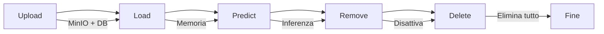

# 🚀 Maverick Platform - Guida Completa API e Amministrazione

**Guida unificata per tutti gli endpoint Maverick**: gestione modelli ML, amministrazione utenti e client API.

## 📋 **Indice**

1. [🤖 Maverick Controller - Gestione Modelli ML](#maverick-controller)
2. [👑 Admin Controller - Gestione Utenti e Client](#admin-controller)
3. [🔐 Autenticazione e Sicurezza](#autenticazione)
4. [🧪 Test Completi](#test-completi)
5. [🔧 Troubleshooting](#troubleshooting)

---

## 🤖 **Maverick Controller - Gestione Modelli ML** {#maverick-controller}

### **📊 Endpoint Principali**

| Endpoint | Metodo | Scopo | Autenticazione |
|----------|---------|-------|----------------|
| `/api/v1/maverick/upload` | POST | Carica modello su storage | JWT |
| `/api/v1/maverick/load` | POST | Attiva modello in memoria | JWT |
| `/api/v1/maverick/predict` | POST | Esegui predizione | JWT |
| `/api/v1/maverick/remove` | DELETE | Disattiva modello | JWT |
| `/api/v1/maverick/delete` | DELETE | Elimina modello completamente | JWT |
| `/api/v1/maverick/models-in-memory` | GET | Lista modelli attivi | JWT |
| `/api/v1/maverick/models-database` | GET | Lista modelli database | JWT |
| `/api/v1/maverick/bootstrap/reload` | POST | Ricarica modelli attivi | JWT |
| `/api/v1/maverick/bootstrap/audit` | GET | Audit sistema | JWT |

### **🔄 Workflow Modello ML**



### **📊 Stati Modello**

| Stato | Database | Memoria | MinIO | Azioni Possibili |
|-------|----------|---------|-------|------------------|
| **Uploaded** | ✅ (inattivo) | ❌ | ✅ | Load, Delete |
| **Active** | ✅ (attivo) | ✅ | ✅ | Predict, Remove, Delete |
| **Removed** | ✅ (inattivo) | ❌ | ✅ | Load, Delete |
| **Deleted** | ❌ | ❌ | ❌ | Upload nuovo |

### **1. Upload Modello**
```bash
# Upload modello ONNX
curl -X POST "http://localhost:8080/api/v1/maverick/upload" \
  -H "Authorization: Bearer $TOKEN" \
  -F "file=@iris.onnx" \
  -F "modelName=iris" \
  -F "version=v1.0" \
  -F "type=ONNX" \
  -F "description=Iris classification model"
```

### **2. Attivazione Modello**
```bash
# Carica modello in memoria
curl -X POST "http://localhost:8080/api/v1/maverick/load?modelName=iris&version=v1.0" \
  -H "Authorization: Bearer $TOKEN"
```

### **3. Predizione**
```bash
# Esegui predizione
curl -X POST "http://localhost:8080/api/v1/maverick/predict?modelName=iris&version=v1.0" \
  -H "Authorization: Bearer $TOKEN" \
  -H "Content-Type: application/json" \
  -d '{"features": [5.1, 3.5, 1.4, 0.2]}'
```

### **4. Gestione Modelli**
```bash
# Lista modelli in memoria
curl -X GET "http://localhost:8080/api/v1/maverick/models-in-memory" \
  -H "Authorization: Bearer $TOKEN"

# Lista modelli database
curl -X GET "http://localhost:8080/api/v1/maverick/models-database?page=0&size=10" \
  -H "Authorization: Bearer $TOKEN"

# Disattiva modello
curl -X DELETE "http://localhost:8080/api/v1/maverick/remove?modelName=iris&version=v1.0" \
  -H "Authorization: Bearer $TOKEN"

# Elimina modello completamente
curl -X DELETE "http://localhost:8080/api/v1/maverick/delete?modelName=iris&version=v1.0" \
  -H "Authorization: Bearer $TOKEN"
```

---

## 👑 **Admin Controller - Gestione Utenti e Client** {#admin-controller}

### **🔒 Endpoint Amministrativi**

| Endpoint | Metodo | Scopo | Accesso |
|----------|---------|-------|---------|
| `/api/admin/users` | POST | Crea nuovo utente | ADMIN |
| `/api/admin/users` | GET | Lista tutti gli utenti | ADMIN |
| `/api/admin/users/{id}` | DELETE | Elimina utente | ADMIN |
| `/api/admin/api-clients` | POST | Crea nuovo client API | ADMIN |
| `/api/admin/api-clients` | GET | Lista tutti i client API | ADMIN |
| `/api/admin/api-clients/{id}` | DELETE | Elimina client API | ADMIN |

### **👥 Gestione Utenti**

#### **Creazione Utente**
```bash
# Crea nuovo utente
curl -X POST "http://localhost:8080/api/admin/users" \
  -H "Authorization: Bearer $ADMIN_TOKEN" \
  -H "Content-Type: application/json" \
  -d '{
    "username": "newuser",
    "email": "newuser@example.com",
    "password": "SecurePass123!",
    "role": "USER",
    "firstName": "Mario",
    "lastName": "Rossi"
  }'
```

#### **Lista Utenti**
**⚠️ ATTENZIONE**: Espone hash password - Solo per debug/admin!
```bash
# Lista tutti gli utenti con dettagli completi
curl -X GET "http://localhost:8080/api/admin/users" \
  -H "Authorization: Bearer $ADMIN_TOKEN"
```

#### **Eliminazione Utente**
```bash
# Elimina utente per ID
curl -X DELETE "http://localhost:8080/api/admin/users/2" \
  -H "Authorization: Bearer $ADMIN_TOKEN"
```

### **🔧 Gestione Client API**

#### **Creazione Client API**
```bash
# Crea nuovo client API
curl -X POST "http://localhost:8080/api/admin/api-clients" \
  -H "Authorization: Bearer $ADMIN_TOKEN" \
  -H "Content-Type: application/json" \
  -d '{
    "clientId": "ml-app-client",
    "clientSecret": "super-secret-key-123",
    "name": "ML Application Client",
    "description": "Client per applicazioni ML",
    "adminAccess": false,
    "rateLimitPerMinute": 100
  }'
```

#### **Lista Client API**
**⚠️ ATTENZIONE**: Espone hash secret - Solo per debug/admin!
```bash
# Lista tutti i client API con dettagli completi
curl -X GET "http://localhost:8080/api/admin/api-clients" \
  -H "Authorization: Bearer $ADMIN_TOKEN"
```

#### **Eliminazione Client API**
```bash
# Elimina client API per ID
curl -X DELETE "http://localhost:8080/api/admin/api-clients/2" \
  -H "Authorization: Bearer $ADMIN_TOKEN"
```

---

## 🔐 **Autenticazione e Sicurezza** {#autenticazione}

### **🔑 Login Utente**
```bash
# Login utente normale
USER_TOKEN=$(curl -s -X POST "http://localhost:8080/api/auth/login" \
  -H "Content-Type: application/json" \
  -d '{"username":"user","password":"password"}' | jq -r '.token')

echo "User Token: $USER_TOKEN"
```

### **👑 Login Admin**
```bash
# Login amministratore
ADMIN_TOKEN=$(curl -s -X POST "http://localhost:8080/api/auth/login" \
  -H "Content-Type: application/json" \
  -d '{"username":"admin","password":"password"}' | jq -r '.token')

echo "Admin Token: $ADMIN_TOKEN"
```

### **🔧 Login Client API**
```bash
# Autenticazione client API
API_TOKEN=$(curl -s -X POST "http://localhost:8080/api/auth/api-client" \
  -H "Content-Type: application/json" \
  -d '{"clientId":"test-client","clientSecret":"test-secret"}' | jq -r '.token')

echo "API Token: $API_TOKEN"
```

### **🛡️ Livelli di Accesso**

| Endpoint Pattern | USER | ADMIN | API_CLIENT |
|------------------|------|-------|------------|
| `/api/v1/maverick/**` | ✅ | ✅ | ✅ |
| `/api/admin/**` | ❌ | ✅ | ❌ |
| `/api/auth/**` | ✅ | ✅ | ✅ |

---

## 🧪 **Test Completi** {#test-completi}

### **🚀 Test Workflow Completo ML**

```bash
#!/bin/bash
# Test completo piattaforma Maverick

echo "🔐 1. Autenticazione..."
ADMIN_TOKEN=$(curl -s -X POST "http://localhost:8080/api/auth/login" \
  -H "Content-Type: application/json" \
  -d '{"username":"admin","password":"password"}' | jq -r '.token')

echo "👥 2. Creazione utente ML..."
curl -X POST "http://localhost:8080/api/admin/users" \
  -H "Authorization: Bearer $ADMIN_TOKEN" \
  -H "Content-Type: application/json" \
  -d '{
    "username": "ml-engineer",
    "email": "ml@example.com",
    "password": "MLPass123!",
    "role": "USER",
    "firstName": "Data",
    "lastName": "Scientist"
  }'

echo "🔧 3. Creazione client API..."
curl -X POST "http://localhost:8080/api/admin/api-clients" \
  -H "Authorization: Bearer $ADMIN_TOKEN" \
  -H "Content-Type: application/json" \
  -d '{
    "clientId": "ml-production",
    "clientSecret": "prod-secret-789",
    "name": "Production ML Client",
    "description": "Client per ambiente production",
    "adminAccess": false,
    "rateLimitPerMinute": 1000
  }'

echo "🤖 4. Upload modello..."
curl -X POST "http://localhost:8080/api/v1/maverick/upload" \
  -H "Authorization: Bearer $ADMIN_TOKEN" \
  -F "file=@iris.onnx" \
  -F "modelName=iris-production" \
  -F "version=v2.0" \
  -F "type=ONNX" \
  -F "description=Production iris model"

echo "⚡ 5. Attivazione modello..."
curl -X POST "http://localhost:8080/api/v1/maverick/load?modelName=iris-production&version=v2.0" \
  -H "Authorization: Bearer $ADMIN_TOKEN"

echo "🎯 6. Test predizione..."
curl -X POST "http://localhost:8080/api/v1/maverick/predict?modelName=iris-production&version=v2.0" \
  -H "Authorization: Bearer $ADMIN_TOKEN" \
  -H "Content-Type: application/json" \
  -d '{"features": [5.1, 3.5, 1.4, 0.2]}'

echo "📊 7. Audit sistema..."
curl -X GET "http://localhost:8080/api/v1/maverick/bootstrap/audit" \
  -H "Authorization: Bearer $ADMIN_TOKEN"

echo "✅ Test completato!"
```

### **🔍 Test Sicurezza**

```bash
# Test accesso negato senza token
curl -X GET "http://localhost:8080/api/admin/users"
# Expected: 401 Unauthorized

# Test accesso negato con ruolo USER
USER_TOKEN=$(curl -s -X POST "http://localhost:8080/api/auth/login" \
  -H "Content-Type: application/json" \
  -d '{"username":"user","password":"password"}' | jq -r '.token')

curl -X GET "http://localhost:8080/api/admin/users" \
  -H "Authorization: Bearer $USER_TOKEN"
# Expected: 403 Forbidden

# Test accesso corretto con ruolo ADMIN
curl -X GET "http://localhost:8080/api/admin/users" \
  -H "Authorization: Bearer $ADMIN_TOKEN"
# Expected: 200 OK con lista utenti
```

---

## 🔧 **Troubleshooting** {#troubleshooting}

### **❌ Errori Comuni**

#### **401 Unauthorized**
- **Causa**: Token mancante o scaduto
- **Soluzione**: Rifai login e ottieni nuovo token

#### **403 Forbidden**
- **Causa**: Ruolo insufficiente per l'endpoint
- **Soluzione**: Usa token con ruolo ADMIN per endpoint `/api/admin/**`

#### **400 Bad Request**
- **Causa**: Dati richiesta non validi o duplicati
- **Soluzione**: Verifica JSON e unicità username/clientId

#### **404 Not Found**
- **Causa**: Risorsa (utente/client/modello) non esistente
- **Soluzione**: Verifica ID o nome risorsa

#### **500 Internal Server Error**
- **Causa**: Errore server o database
- **Soluzione**: Controlla log applicazione e connessione DB

### **🔍 Debug**

```bash
# Verifica token JWT
echo $ADMIN_TOKEN | base64 -d | jq .

# Test connessione database
curl -X GET "http://localhost:8080/api/admin/users" \
  -H "Authorization: Bearer $ADMIN_TOKEN" \
  -v

# Verifica storage MinIO
curl -X GET "http://localhost:8080/api/v1/maverick/models-database" \
  -H "Authorization: Bearer $ADMIN_TOKEN"
```

### **⚠️ Considerazioni Sicurezza**

1. **Hash Exposure**: Gli endpoint GET `/api/admin/users` e `/api/admin/api-clients` espongono hash password/secret per debug
2. **Token Management**: I token JWT hanno durata limitata (15 minuti default)
3. **Rate Limiting**: I client API hanno limiti configurabili per richieste al minuto
4. **Audit Trail**: Tutte le operazioni admin sono loggate per audit

---

## 📚 **Risorse Aggiuntive**

- **Swagger UI**: `http://localhost:8080/swagger-ui.html`
- **Health Check**: `http://localhost:8080/actuator/health`
- **Database Schema**: Consulta `database/schema.sql`
- **Configuration**: Controlla `application.properties`

---

*Documentazione aggiornata al: $(date)*
*Maverick Platform v1.0 - Sistema completo di gestione modelli ML e utenti*
