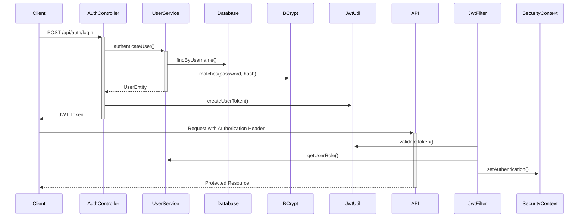

# � Maverick ML Platform - Guida Completa

**Maverick** è una piattaforma completa per la gestione e predizione di modelli Machine Learning con sistema di autenticazione JWT integrato.

## 📋 Indice

- [🏗️ Architettura del Sistema](#architettura)
- [🔐 Sistema di Autenticazione](#autenticazione)
- [🤖 Gestione Modelli ML](#modelli)
- [⚡ Quick Start](#quick-start)
- [🛡️ Sicurezza e Permessi](#sicurezza)
- [📡 API Reference](#api-reference)
- [🔧 Configurazione](#configurazione)
- [🐛 Troubleshooting](#troubleshooting)

---

## 🏗️ Architettura del Sistema {#architettura}

### **Stack Tecnologico**
- **Backend**: Spring Boot 3.x con Spring Security
- **Database**: PostgreSQL per metadati e utenti
- **Storage**: MinIO (S3-compatible) per modelli ML
- **Cache**: Caffeine per performance
- **Autenticazione**: JWT stateless
- **Documenti**: Swagger/OpenAPI 3

### **Componenti Principali**
```
📦 Maverick Platform
├── 🔐 Autenticazione JWT (dual-mode)
├── 🤖 Engine ML (PMML, ONNX, Scikit-learn)
├── 💾 Database PostgreSQL
├── 🗄️ Storage MinIO
├── 📊 Monitoring & Audit
└── 📚 API Documentation
```

---

## � Sistema di Autenticazione {#autenticazione}

### **Autenticazione Duale**

#### **1. Utenti Umani** (Web/App)
- **Metodo**: Username + Password
- **Token TTL**: 15 minuti (configurabile)
- **Ruoli**: ADMIN, PREDICTOR
- **Endpoint**: `POST /api/auth/login`

#### **2. Client API** (Machine-to-Machine)
- **Metodo**: Client ID + Client Secret
- **Token TTL**: 24 ore (configurabile) 
- **Accessi**: Admin completo o Solo predizioni
- **Endpoint**: `POST /api/auth/token`

### **🔑 Credenziali di Test**

| Tipo | Username/Client ID | Password/Secret | Ruolo | Accesso |
|------|-------------------|-----------------|-------|---------|
| **Utente** | `admin` | `password` | ADMIN | Completo |
| **Utente** | `test` | `test123` | PREDICTOR | Solo predizioni |
| **Client** | `test-admin-client` | `admin123` | ADMIN | Completo |
| **Client** | `test-predictor-client` | `predictor123` | PREDICTOR | Solo predizioni |

### **🎯 Controllo Accessi**

#### **Solo ADMIN**
- Upload/cancellazione modelli
- Gestione utenti e client
- Monitoring e audit completo
- Configurazione sistema

#### **ADMIN + PREDICTOR**
- Predizioni su modelli
- Visualizzazione schema input/output
- Lista modelli disponibili
- Informazioni modelli

---

## 🤖 Gestione Modelli ML {#modelli}

### **Formati Supportati**
- **PMML**: Predictive Model Markup Language
- **ONNX**: Open Neural Network Exchange
- **Scikit-learn**: Pickle serialization (.pkl)

### **Ciclo di Vita Modello**
1. **Upload**: Caricamento su MinIO + metadati in DB
2. **Bootstrap**: Caricamento automatico in memoria
3. **Predizione**: Inferenza real-time
4. **Monitoring**: Tracking utilizzo e performance
5. **Gestione**: Versioning e deprecazione

### **Storage e Metadata**
```sql
-- Struttura principale ModelEntity
{
  "modelName": "iris-classifier",
  "version": "1.0.0", 
  "type": "PMML",
  "storageType": "MINIO",
  "filePath": "iris-classifier/1.0.0/model.pmml",
  "uploadTimestamp": "2024-08-06T14:30:00Z",
  "isActive": true,
  "inputSchema": {...},
  "outputSchema": {...}
}
```

---

## ⚡ Quick Start {#quick-start}

### **1. Setup Database**
```bash
# Esegui setup completo
psql -h localhost -d maverickDB -U maverick -f database/setup_auth_database.sql

# Inserisci dati di test
psql -h localhost -d maverickDB -U maverick -f database/simple_test_data.sql
```

### **2. Configurazione**
```properties
# application.properties
maverick.security.enabled=true
maverick.jwt.secret=your-production-secret
maverick.jwt.user-expiration=900000
maverick.jwt.client-expiration=86400000

# Storage MinIO
maverick.storage.provider=minio
maverick.storage.minio.endpoint=http://localhost:9000
maverick.storage.minio.access-key=your-access-key
maverick.storage.minio.secret-key=your-secret-key
```

### **3. Avvio Applicazione**
```bash
mvn spring-boot:run
```

### **4. Test Autenticazione**
```bash
# Login utente
curl -X POST http://localhost:8080/api/auth/login \
  -H "Content-Type: application/json" \
  -d '{"username":"admin","password":"password"}'

# Risposta con token
{
  "token": "eyJhbGciOiJIUzUxMiJ9...",
  "tokenType": "Bearer",
  "expiresIn": 900,
  "username": "admin",
  "email": "admin@maverick.com",
  "role": "ADMIN"
}
```

### **5. Test Predizione**
```bash
# Usa il token ottenuto
curl -X POST http://localhost:8080/api/v1/maverick/predict/1.0/iris-classifier \
  -H "Authorization: Bearer YOUR_TOKEN" \
  -H "Content-Type: application/json" \
  -d '{"data": [5.1, 3.5, 1.4, 0.2]}'
```

---

## 🛡️ Sicurezza e Permessi {#sicurezza}

### **Architettura di Sicurezza**
- **Stateless JWT**: Nessuna sessione server-side
- **Role-based Access**: Controlli granulari per endpoint
- **Database verification**: Verifica ruoli in tempo reale
- **Token expiration**: TTL configurabile per sicurezza
- **BCrypt hashing**: Password sicure (costo 10-12)

### **Endpoint Security Mapping**

| Endpoint | Metodo | Accesso Richiesto |
|----------|--------|-------------------|
| `/api/auth/**` | ALL | Pubblico |
| `/api/v1/maverick/upload` | POST | ADMIN |
| `/api/v1/maverick/delete` | DELETE | ADMIN |
| `/api/v1/maverick/predict/**` | POST | ADMIN + PREDICTOR |
| `/api/v1/maverick/models/*/input-schema` | GET | ADMIN + PREDICTOR |
| `/swagger-ui/**` | GET | Pubblico (dev) |

### **Processo di Autenticazione**


---

## 📡 API Reference {#api-reference}

### **Autenticazione Endpoints**

#### **POST /api/auth/login**
Login utente umano
```json
// Request
{
  "username": "admin",
  "password": "password"
}

// Response 200
{
  "token": "eyJ...",
  "tokenType": "Bearer",
  "expiresIn": 900,
  "username": "admin",
  "email": "admin@maverick.com", 
  "role": "ADMIN"
}
```

#### **POST /api/auth/token**
Autenticazione client API
```json
// Request
{
  "clientId": "test-admin-client",
  "clientSecret": "admin123",
  "grantType": "client_credentials"
}

// Response 200
{
  "accessToken": "eyJ...",
  "tokenType": "Bearer", 
  "expiresIn": 86400,
  "scope": "upload,predict,schema,manage"
}
```

#### **POST /api/auth/validate**
Validazione token
```bash
# Headers
Authorization: Bearer eyJ...

# Response 200: Token valido
# Response 401: Token invalido/scaduto
```

#### **GET /api/auth/me**
Informazioni utente corrente
```json
// Response per utente umano
{
  "username": "admin",
  "email": "admin@maverick.com",
  "role": "ADMIN", 
  "userType": "HUMAN"
}

// Response per client API
{
  "clientId": "test-admin-client",
  "role": "ADMIN",
  "userType": "MACHINE"
}
```

### **Modelli ML Endpoints**

#### **POST /api/v1/maverick/upload** 🔒 ADMIN
Upload nuovo modello

```bash
curl -X POST http://localhost:8080/api/v1/maverick/upload \
  -H "Authorization: Bearer TOKEN" \
  -F "file=@model.pmml" \
  -F "modelName=iris-classifier" \
  -F "version=2.0.0" \
  -F "type=PMML" \
  -F "description=Updated iris classifier"
```

#### **POST /api/v1/maverick/predict/{version}/{modelName}** 🔒 ADMIN/PREDICTOR
Esegui predizione
```json
// Request
{
  "data": [5.1, 3.5, 1.4, 0.2]
}

// Response
{
  "prediction": "setosa",
  "confidence": 0.95,
  "modelInfo": {
    "name": "iris-classifier",
    "version": "1.0.0", 
    "type": "PMML"
  },
  "executionTime": 45
}
```

#### **GET /api/v1/maverick/models/{modelName}/versions/{version}/input-schema** 🔒 ADMIN/PREDICTOR
Schema input modello
```json
{
  "modelName": "iris-classifier",
  "version": "1.0.0",
  "inputSchema": {
    "type": "object",
    "properties": {
      "sepal_length": {"type": "number"},
      "sepal_width": {"type": "number"},
      "petal_length": {"type": "number"}, 
      "petal_width": {"type": "number"}
    },
    "required": ["sepal_length", "sepal_width", "petal_length", "petal_width"]
  }
}
```

#### **DELETE /api/v1/maverick/delete** 🔒 ADMIN
Cancella modello
```bash
curl -X DELETE "http://localhost:8080/api/v1/maverick/delete?modelName=iris&version=1.0&deleteFromStorage=true" \
  -H "Authorization: Bearer TOKEN"
```

#### **GET /api/v1/maverick/models-database** 🔒 ADMIN
Lista modelli nel database
```json
{
  "models": [
    {
      "id": 1,
      "modelName": "iris-classifier",
      "version": "1.0.0",
      "type": "PMML",
      "uploadTimestamp": "2024-08-06T14:30:00Z",
      "isActive": true,
      "fileSize": 15420
    }
  ],
  "pagination": {
    "page": 0,
    "size": 10,
    "totalElements": 1,
    "totalPages": 1
  }
}
```

---

## 🔧 Configurazione {#configurazione}

### **Database PostgreSQL**
```sql
-- Connessione
spring.datasource.url=jdbc:postgresql://localhost:5432/maverickDB
spring.datasource.username=maverick
spring.datasource.password=your-password

-- Pool connessioni
spring.datasource.hikari.maximum-pool-size=10
spring.datasource.hikari.minimum-idle=5
```

### **Storage MinIO**
```properties
# Configurazione MinIO
maverick.storage.provider=minio
maverick.storage.minio.endpoint=http://localhost:9000
maverick.storage.minio.access-key=minio-user
maverick.storage.minio.secret-key=minio-password
maverick.storage.minio.default-bucket=maverick
maverick.storage.minio.use-ssl=false
```

### **Sicurezza JWT**
```properties
# JWT Configuration
maverick.security.enabled=true
maverick.jwt.secret=maverick-super-secret-key-change-in-production
maverick.jwt.user-expiration=900000      # 15 minuti
maverick.jwt.client-expiration=86400000  # 24 ore
```

### **Cache Performance**
```properties
# Caffeine Cache
spring.cache.type=caffeine
spring.cache.caffeine.spec=maximumSize=1000,expireAfterWrite=5m
spring.cache.cache-names=userRoles,clientRoles,modelSchemas
```

### **Logging e Monitoring**
```properties
# Logging levels
logging.level.com.maiolix.maverick.security=DEBUG
logging.level.com.maiolix.maverick.service=INFO
logging.level.org.springframework.security=WARN

# Actuator endpoints
management.endpoints.web.exposure.include=health,info,metrics
management.endpoint.health.show-details=when-authorized
```

---

## 🐛 Troubleshooting {#troubleshooting}

### **Problemi Comuni**

#### **❌ Errore: "permission denied for table users"**
```bash
# Soluzione: Assegna permessi database
psql -h localhost -d maverickDB -U postgres
GRANT ALL PRIVILEGES ON TABLE users TO maverick;
GRANT ALL PRIVILEGES ON TABLE api_clients TO maverick;
GRANT USAGE, SELECT ON ALL SEQUENCES IN SCHEMA public TO maverick;
```

#### **❌ Errore: "Failed login attempt"**
```bash
# Debug: Verifica password hash
curl http://localhost:8080/api/debug/test-passwords

# Rigenera utenti di test
psql -h localhost -d maverickDB -U maverick -f database/simple_test_data.sql
```

#### **❌ Errore: "Circular dependency between beans"**
```java
// Soluzione: Verificare che CryptoConfig sia separato da SecurityConfig
@Configuration
public class CryptoConfig {
    @Bean
    public PasswordEncoder passwordEncoder() {
        return new BCryptPasswordEncoder(10);
    }
}
```

#### **❌ Errore: "MinIO connection failed"**
```bash
# Verifica MinIO in esecuzione
docker ps | grep minio

# Test connessione
curl http://localhost:9000/minio/health/live
```

#### **❌ Errore: "Token expired"**
```bash
# Rinnova token
curl -X POST http://localhost:8080/api/auth/login \
  -H "Content-Type: application/json" \
  -d '{"username":"admin","password":"password"}'
```

### **Debug Endpoints** (Solo sviluppo)
```bash
# Genera hash password
curl -X POST "http://localhost:8080/api/debug/hash-password?password=mypassword"

# Verifica hash
curl -X POST "http://localhost:8080/api/debug/verify-password?password=test&hash=\$2b\$10\$..."

# Test password predefinite  
curl http://localhost:8080/api/debug/test-passwords
```

### **Health Checks**
```bash
# Status applicazione
curl http://localhost:8080/actuator/health

# Info sistema
curl http://localhost:8080/actuator/info


  },
  "reloadedAt": "2025-08-06T16:00:00"
}
```

#### 12. **Audit Sistema**
```http
GET /api/v1/maverick/bootstrap/audit
```

Verifica consistenza tra database e memoria.

**Risposta:**
```json
{
  "status": "SUCCESS",
  "message": "Audit modelli completato",
  "statistics": {
    "databaseActiveModels": 3,
    "memoryCachedModels": 3,
    "isConsistent": true,
    "missingInCache": 0,
    "extraInCache": 0
  },
  "details": {
    "activeModelsInDb": ["iris-classifier_v1.0", "fraud-detector_v2.1"],
    "cachedModelsInMemory": ["iris-classifier_v1.0", "fraud-detector_v2.1"],
    "missingInCache": [],
    "extraInCache": []
  },
  "timestamp": "2025-08-06T16:05:00"
}
```

---

## 📊 **Stati e Workflow Modello**

### Stati Modello

| Stato | Database | Memoria | MinIO | Azioni Possibili |
|-------|----------|---------|-------|------------------|
| **Uploaded** | ✅ (inattivo) | ❌ | ✅ | Load, Delete |
| **Active** | ✅ (attivo) | ✅ | ✅ | Predict, Remove, Delete |
| **Removed** | ✅ (inattivo) | ❌ | ✅ | Load, Delete |
| **Deleted** | ❌ | ❌ | ❌ | Upload nuovo |

### Workflow Tipico


### Caricamento Automatico (Bootstrap)

All'avvio dell'applicazione:
1. **Scan Database**: Trova tutti i modelli con `isActive: true`
2. **Load Memory**: Carica automaticamente i modelli in memoria
3. **Error Handling**: Se un modello non può essere caricato, viene disattivato
4. **Statistics**: Log dettagliati del processo di caricamento

---

## 🎯 **Casi d'Uso e Esempi**

### Per Sviluppatori API

**1. Controllo Schema Prima della Predizione**
```bash
# Ottenere schema di input
curl -X GET "http://localhost:8080/api/v1/maverick/models/iris-classifier/versions/v1.0/input-schema"

# Utilizzare le informazioni per formattare correttamente la richiesta
curl -X POST "http://localhost:8080/api/v1/maverick/predict?modelName=iris-classifier&version=v1.0" \
  -H "Content-Type: application/json" \
  -d '{"features": [5.1, 3.5, 1.4, 0.2]}'
```

**2. Integrazione con Validazione**
```javascript
// JavaScript esempio
async function predictWithValidation(modelName, version, data) {
  // 1. Ottieni schema
  const schema = await fetch(`/api/v1/maverick/models/${modelName}/versions/${version}/input-schema`);
  
  // 2. Valida dati
  if (validateInput(data, schema.inputSchema)) {
    // 3. Esegui predizione
    return await fetch(`/api/v1/maverick/predict?modelName=${modelName}&version=${version}`, {
      method: 'POST',
      body: JSON.stringify(data)
    });
  }
}
```

### Per Data Scientists

**1. Esplorazione Modelli**
```bash
# Panoramica di tutti i modelli
curl -X GET "http://localhost:8080/api/v1/maverick/models/schemas"

# Dettagli specifici modello
curl -X GET "http://localhost:8080/api/v1/maverick/models/iris-classifier/versions/v1.0/info"
```

**2. Debug e Monitoraggio**
```bash
# Verifica stato modelli
curl -X GET "http://localhost:8080/api/v1/maverick/bootstrap/audit"

# Lista modelli in memoria
curl -X GET "http://localhost:8080/api/v1/maverick/models-in-memory"
```

### Per DevOps

**1. Health Check e Monitoring**
```bash
# Check consistenza sistema
curl -X GET "http://localhost:8080/api/v1/maverick/bootstrap/audit"

# Ricarica modelli se necessario
curl -X POST "http://localhost:8080/api/v1/maverick/bootstrap/reload"
```

**2. Deployment Automation**
```bash
#!/bin/bash
# Script di deployment modello

MODEL_NAME="new-model"
VERSION="v1.0"
MODEL_FILE="model.onnx"

# 1. Upload
curl -X POST -F "file=@${MODEL_FILE}" \
  -F "modelName=${MODEL_NAME}" \
  -F "version=${VERSION}" \
  -F "type=ONNX" \
  http://localhost:8080/api/v1/maverick/upload

# 2. Activate
curl -X POST "http://localhost:8080/api/v1/maverick/load?modelName=${MODEL_NAME}&version=${VERSION}"

# 3. Test
curl -X POST -H "Content-Type: application/json" \
  -d '{"features": [1,2,3,4]}' \
  "http://localhost:8080/api/v1/maverick/predict?modelName=${MODEL_NAME}&version=${VERSION}"

# 4. Verify
curl -X GET "http://localhost:8080/api/v1/maverick/bootstrap/audit"
```

---

## 🔍 **Gestione Errori**

### Errori Comuni

**Upload Errors:**
```json
{
  "errorCode": "MODEL_UPLOAD_ERROR",
  "message": "Tipo modello non valido: INVALID",
  "path": "/api/v1/maverick/upload",
  "status": 400,
  "suggestion": "Valori supportati: ONNX, PMML, MOJO, H2O"
}
```

**Model Not Found:**
```json
{
  "status": "ERROR",
  "message": "Modello iris-classifier versione v1.0 non trovato in memoria",
  "timestamp": "2025-08-06T..."
}
```

**Validation Errors:**
- File vuoto o troppo grande (>100MB)
- Nome modello non valido (solo alfanumerici, _, -)
- Versione formato errato (richiesto v1.0 o 1.0.0)
- Modello duplicato già esistente

---

## 🚀 **Performance e Optimizzazioni**

### Cache Strategy
- **Memory First**: Predizioni da cache in memoria per latenza minima
- **Lazy Loading**: Caricamento modelli su richiesta
- **Auto Bootstrap**: Caricamento automatico modelli attivi all'avvio
- **Registry Pattern**: Gestione centralizzata modelli con `ModelRegistry`

### Monitoring
- **Execution Time**: Tracking tempo esecuzione predizioni
- **Usage Statistics**: Contatori utilizzo per modello
- **Health Checks**: Audit automatici consistenza DB-Memory
- **Error Tracking**: Log dettagliati per debugging

### Scalability
- **Stateless Design**: Architettura stateless per scaling orizzontale
- **External Storage**: MinIO per storage distribuito
- **Database Pagination**: Paginazione per grandi volumi
- **Async Operations**: Operazioni non bloccanti dove possibile

---

## 🔧 **Configurazione e Setup**

### Variabili di Ambiente
```properties
# MinIO Configuration
minio.endpoint=http://localhost:9000
minio.access-key=minioadmin
minio.secret-key=minioadmin
minio.bucket-name=maverick

# Database Configuration
spring.datasource.url=jdbc:postgresql://localhost:5432/maverick
spring.datasource.username=maverick
spring.datasource.password=maverick

# Upload Configuration
spring.servlet.multipart.max-file-size=100MB
spring.servlet.multipart.max-request-size=100MB
```

### Test Rapido
```bash
# 1. Avvia applicazione
mvn spring-boot:run

# 2. Test upload completo
./test_maverick_upload.bat

# 3. Test workflow completo
./test_maverick_complete.bat

# 4. Verifica risultati
curl -X GET "http://localhost:8080/api/v1/maverick/bootstrap/audit"
```

### Monitoraggio Endpoints
- **Swagger UI**: http://localhost:8080/swagger-ui.html
- **Health Check**: http://localhost:8080/actuator/health
- **MinIO Console**: http://localhost:9000
- **Database**: localhost:5432/maverick

---

## 📚 **Benefici e Vantaggi**

### 🎯 **Self-Documentation**
- I modelli si auto-documentano esponendo la loro struttura
- Schema dettagliato per ogni tipo di modello (ONNX, PMML, MOJO)
- Esempi di input automatici per testing

### ⚡ **Performance**
- Cache in memoria per predizioni sub-millisecondo
- Caricamento lazy e bootstrap automatico
- Storage distribuito con MinIO

### 🔒 **Robustezza**
- Gestione errori completa con suggstioni
- Audit automatici per consistenza
- Backup automatico metadati su database

### 🔧 **Flessibilità**
- Supporto multi-formato (ONNX, PMML, MOJO, H2O)
- API REST standard per facile integrazione
- Workflow completo dalla upload alla produzione

### 📊 **Monitoraggio**
- Statistiche di utilizzo per ogni modello
- Tracking performance e errori
- Health checks automatici

---

*Documentazione generata: 6 Agosto 2025*
