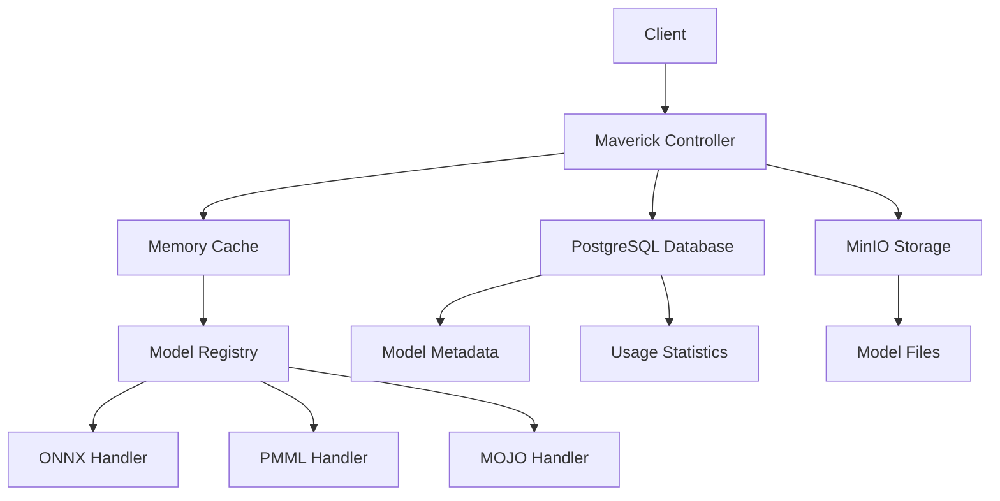

# 📖 Maverick Controller - Guida Completa API

## 🎯 Panoramica

Maverick è un sistema completo per la gestione e l'esecuzione di modelli di Machine Learning in production. Supporta modelli ONNX, PMML, MOJO e H2O con storage su MinIO, metadati su PostgreSQL e cache in memoria per predizioni ad alte prestazioni.

## 🚀 Architettura



---

## 📋 API Reference

### 🔄 **Gestione Ciclo di Vita Modelli**

#### 1. **Upload Modello**
```http
POST /api/v1/maverick/upload
Content-Type: multipart/form-data
```

Carica modello su MinIO e salva metadati nel database (stato: **inattivo**).

**Parametri:**
- `file` (MultipartFile) - File modello (max 100MB)
- `modelName` (String) - Nome modello
- `version` (String) - Versione (es: v1.0)
- `type` (String) - ONNX|PMML|MOJO|H2O
- `description` (String, opz) - Descrizione

**Esempio:**
```bash
curl -X POST -F "file=@model.onnx" -F "modelName=iris-classifier" -F "version=v1.0" -F "type=ONNX" -F "description=Iris classification model" \
  http://localhost:8080/api/v1/maverick/upload
```

**Risposta:**
```json
{
  "status": "SUCCESS",
  "message": "Modello caricato su MinIO e salvato nel database con successo",
  "modelName": "iris-classifier",
  "version": "v1.0",
  "modelUuid": "550e8400-e29b-41d4-a716-446655440000",
  "minioPath": "iris-classifier/v1.0/model.onnx",
  "fileSize": 2048576,
  "createdAt": "2025-08-06T10:30:00",
  "isActive": false,
  "timestamp": "2025-08-06T10:30:00"
}
```

#### 2. **Attiva Modello**
```http
POST /api/v1/maverick/load?modelName=iris-classifier&version=v1.0
```

Carica modello da MinIO in memoria e lo attiva nel database.

**Risposta:**
```json
{
  "status": "SUCCESS",
  "message": "Modello caricato e attivato con successo in memoria",
  "modelName": "iris-classifier",
  "version": "v1.0",
  "type": "ONNX",
  "fileSize": 2048576,
  "minioPath": "iris-classifier/v1.0/model.onnx",
  "loadedAt": "2025-08-06T10:35:00",
  "cached": true,
  "isActive": true
}
```

#### 3. **Predizione**
```http
POST /api/v1/maverick/predict?modelName=iris-classifier&version=v1.0
Content-Type: application/json

{
  "features": [5.1, 3.5, 1.4, 0.2]
}
```

**Risposta:**
```json
{
  "status": "SUCCESS",
  "prediction": {
    "class": "setosa",
    "probability": 0.98,
    "scores": [0.98, 0.01, 0.01]
  },
  "modelName": "iris-classifier",
  "version": "v1.0",
  "executionTimeMs": 15,
  "timestamp": "2025-08-06T10:40:00"
}
```

#### 4. **Disattiva Modello**
```http
DELETE /api/v1/maverick/remove?modelName=iris-classifier&version=v1.0
```

Rimuove da memoria e disattiva nel database (file su MinIO rimane).

#### 5. **Elimina Modello**
```http
DELETE /api/v1/maverick/delete?modelName=iris-classifier&version=v1.0
```

Elimina da memoria, database E MinIO completamente.

---

### 📊 **Schema e Informazioni Modelli**

#### 6. **Schema di Input Specifico**
```http
GET /api/v1/maverick/models/{modelName}/versions/{version}/input-schema
```

Restituisce informazioni dettagliate sui parametri di input richiesti da un modello specifico.

**Risposta:**
```json
{
  "status": "SUCCESS",
  "message": "Schema di input recuperato con successo",
  "inputSchema": {
    "modelType": "ONNX",
    "totalInputs": 1,
    "inputNames": ["features"],
    "expectedFeatures": 4,
    "featureNames": ["sepal_length", "sepal_width", "petal_length", "petal_width"],
    "featureTypes": ["float32", "float32", "float32", "float32"],
    "inputShape": [1, 4],
    "description": "float32 tensor with shape [1, 4]",
    "supervised": true,
    "outputClasses": 3,
    "labelMapping": {"0": "setosa", "1": "versicolor", "2": "virginica"},
    "inputExample": {
      "features": [5.1, 3.5, 1.4, 0.2]
    }
  },
  "timestamp": "2025-08-06T..."
}
```

#### 7. **Informazioni Complete Modello**
```http
GET /api/v1/maverick/models/{modelName}/versions/{version}/info
```

Restituisce metadati completi, schema di input, informazioni di output e esempi di utilizzo.

**Risposta:**
```json
{
  "status": "SUCCESS",
  "message": "Informazioni modello recuperate con successo",
  "modelInfo": {
    "modelName": "iris-classifier",
    "version": "v1.0",
    "type": "ONNX",
    "hasLabelMapping": true,
    "labelMapping": {"0": "setosa", "1": "versicolor", "2": "virginica"},
    "inputSchema": {
      "modelType": "ONNX",
      "totalInputs": 1,
      "expectedFeatures": 4,
      "featureNames": ["sepal_length", "sepal_width", "petal_length", "petal_width"],
      "description": "float32 tensor with shape [1, 4]"
    },
    "databaseInfo": {
      "uploadedAt": "2025-08-06T10:30:00",
      "filePath": "iris-classifier/v1.0/model.onnx",
      "fileSize": 2048576,
      "isActive": true,
      "description": "Iris classification model",
      "predictionCount": 147,
      "lastUsedAt": "2025-08-06T15:45:00"
    }
  },
  "storageProvider": "MinIO",
  "timestamp": "2025-08-06T..."
}
```

#### 8. **Schema di Tutti i Modelli**
```http
GET /api/v1/maverick/models/schemas
```

Restituisce una panoramica degli schemi di input/output di tutti i modelli caricati in memoria.

**Risposta:**
```json
{
  "status": "SUCCESS",
  "message": "Schema di tutti i modelli recuperati con successo",
  "totalModels": 3,
  "modelsSchemas": {
    "iris-classifier_v1.0": {
      "modelName": "iris-classifier",
      "version": "v1.0",
      "type": "ONNX",
      "hasLabelMapping": true,
      "inputSchema": {
        "modelType": "ONNX",
        "totalInputs": 1,
        "inputNames": ["features"],
        "expectedFeatures": 4,
        "supervised": true,
        "outputClasses": 3,
        "labelMapping": {"0": "setosa", "1": "versicolor", "2": "virginica"}
      }
    },
    "fraud-detector_v2.1": {
      "modelName": "fraud-detector",
      "version": "v2.1",
      "type": "MOJO",
      "hasLabelMapping": false,
      "inputSchema": {
        "modelType": "MOJO",
        "totalFeatures": 15,
        "featureNames": ["amount", "time", "v1", "v2"],
        "supervised": true,
        "outputClasses": 2
      }
    }
  },
  "storageProvider": "MinIO",
  "timestamp": "2025-08-06T..."
}
```

---

### 📋 **Listing e Monitoraggio**

#### 9. **Lista Modelli in Memoria**
```http
GET /api/v1/maverick/models-in-memory
```

**Risposta:**
```json
{
  "status": "SUCCESS",
  "message": "Lista modelli in memoria recuperata con successo",
  "models": [
    {
      "modelName": "iris-classifier",
      "version": "v1.0",
      "type": "ONNX",
      "key": "iris-classifier_v1.0",
      "hasHandler": true,
      "hasLabelMapping": true
    }
  ],
  "statistics": {
    "totalModels": 1,
    "modelTypes": ["ONNX"],
    "uniqueModelNames": 1
  },
  "timestamp": "2025-08-06T..."
}
```

#### 10. **Lista Modelli Database**
```http
GET /api/v1/maverick/models-database?page=0&size=10
```

**Risposta:**
```json
{
  "status": "SUCCESS",
  "message": "Lista modelli nel database recuperata con successo",
  "models": [
    {
      "id": 1,
      "modelUuid": "550e8400-e29b-41d4-a716-446655440000",
      "modelName": "iris-classifier",
      "version": "v1.0",
      "type": "ONNX",
      "description": "Iris classification model",
      "filePath": "iris-classifier/v1.0/model.onnx",
      "fileSize": 2048576,
      "isActive": true,
      "predictionCount": 147,
      "lastUsedAt": "2025-08-06T15:45:00",
      "createdAt": "2025-08-06T10:30:00"
    }
  ],
  "pagination": {
    "totalElements": 1,
    "totalPages": 1,
    "currentPage": 0,
    "pageSize": 10
  },
  "statistics": {
    "totalModels": 1,
    "activeModels": 1,
    "modelTypes": ["ONNX"]
  }
}
```

---

### ⚙️ **Operazioni Bootstrap e Audit**

#### 11. **Ricarica Modelli Attivi**
```http
POST /api/v1/maverick/bootstrap/reload
```

Ricarica tutti i modelli attivi dal database in memoria.

**Risposta:**
```json
{
  "status": "SUCCESS",
  "message": "Ricaricamento modelli completato",
  "before": {
    "databaseActive": 3,
    "memoryCache": 2
  },
  "after": {
    "memoryCache": 3
  },
  "reloadedAt": "2025-08-06T16:00:00"
}
```

#### 12. **Audit Sistema**
```http
GET /api/v1/maverick/bootstrap/audit
```

Verifica consistenza tra database e memoria.

**Risposta:**
```json
{
  "status": "SUCCESS",
  "message": "Audit modelli completato",
  "statistics": {
    "databaseActiveModels": 3,
    "memoryCachedModels": 3,
    "isConsistent": true,
    "missingInCache": 0,
    "extraInCache": 0
  },
  "details": {
    "activeModelsInDb": ["iris-classifier_v1.0", "fraud-detector_v2.1"],
    "cachedModelsInMemory": ["iris-classifier_v1.0", "fraud-detector_v2.1"],
    "missingInCache": [],
    "extraInCache": []
  },
  "timestamp": "2025-08-06T16:05:00"
}
```

---

## 📊 **Stati e Workflow Modello**

### Stati Modello

| Stato | Database | Memoria | MinIO | Azioni Possibili |
|-------|----------|---------|-------|------------------|
| **Uploaded** | ✅ (inattivo) | ❌ | ✅ | Load, Delete |
| **Active** | ✅ (attivo) | ✅ | ✅ | Predict, Remove, Delete |
| **Removed** | ✅ (inattivo) | ❌ | ✅ | Load, Delete |
| **Deleted** | ❌ | ❌ | ❌ | Upload nuovo |

### Workflow Tipico


### Caricamento Automatico (Bootstrap)

All'avvio dell'applicazione:
1. **Scan Database**: Trova tutti i modelli con `isActive: true`
2. **Load Memory**: Carica automaticamente i modelli in memoria
3. **Error Handling**: Se un modello non può essere caricato, viene disattivato
4. **Statistics**: Log dettagliati del processo di caricamento

---

## 🎯 **Casi d'Uso e Esempi**

### Per Sviluppatori API

**1. Controllo Schema Prima della Predizione**
```bash
# Ottenere schema di input
curl -X GET "http://localhost:8080/api/v1/maverick/models/iris-classifier/versions/v1.0/input-schema"

# Utilizzare le informazioni per formattare correttamente la richiesta
curl -X POST "http://localhost:8080/api/v1/maverick/predict?modelName=iris-classifier&version=v1.0" \
  -H "Content-Type: application/json" \
  -d '{"features": [5.1, 3.5, 1.4, 0.2]}'
```

**2. Integrazione con Validazione**
```javascript
// JavaScript esempio
async function predictWithValidation(modelName, version, data) {
  // 1. Ottieni schema
  const schema = await fetch(`/api/v1/maverick/models/${modelName}/versions/${version}/input-schema`);
  
  // 2. Valida dati
  if (validateInput(data, schema.inputSchema)) {
    // 3. Esegui predizione
    return await fetch(`/api/v1/maverick/predict?modelName=${modelName}&version=${version}`, {
      method: 'POST',
      body: JSON.stringify(data)
    });
  }
}
```

### Per Data Scientists

**1. Esplorazione Modelli**
```bash
# Panoramica di tutti i modelli
curl -X GET "http://localhost:8080/api/v1/maverick/models/schemas"

# Dettagli specifici modello
curl -X GET "http://localhost:8080/api/v1/maverick/models/iris-classifier/versions/v1.0/info"
```

**2. Debug e Monitoraggio**
```bash
# Verifica stato modelli
curl -X GET "http://localhost:8080/api/v1/maverick/bootstrap/audit"

# Lista modelli in memoria
curl -X GET "http://localhost:8080/api/v1/maverick/models-in-memory"
```

### Per DevOps

**1. Health Check e Monitoring**
```bash
# Check consistenza sistema
curl -X GET "http://localhost:8080/api/v1/maverick/bootstrap/audit"

# Ricarica modelli se necessario
curl -X POST "http://localhost:8080/api/v1/maverick/bootstrap/reload"
```

**2. Deployment Automation**
```bash
#!/bin/bash
# Script di deployment modello

MODEL_NAME="new-model"
VERSION="v1.0"
MODEL_FILE="model.onnx"

# 1. Upload
curl -X POST -F "file=@${MODEL_FILE}" \
  -F "modelName=${MODEL_NAME}" \
  -F "version=${VERSION}" \
  -F "type=ONNX" \
  http://localhost:8080/api/v1/maverick/upload

# 2. Activate
curl -X POST "http://localhost:8080/api/v1/maverick/load?modelName=${MODEL_NAME}&version=${VERSION}"

# 3. Test
curl -X POST -H "Content-Type: application/json" \
  -d '{"features": [1,2,3,4]}' \
  "http://localhost:8080/api/v1/maverick/predict?modelName=${MODEL_NAME}&version=${VERSION}"

# 4. Verify
curl -X GET "http://localhost:8080/api/v1/maverick/bootstrap/audit"
```

---

## 🔍 **Gestione Errori**

### Errori Comuni

**Upload Errors:**
```json
{
  "errorCode": "MODEL_UPLOAD_ERROR",
  "message": "Tipo modello non valido: INVALID",
  "path": "/api/v1/maverick/upload",
  "status": 400,
  "suggestion": "Valori supportati: ONNX, PMML, MOJO, H2O"
}
```

**Model Not Found:**
```json
{
  "status": "ERROR",
  "message": "Modello iris-classifier versione v1.0 non trovato in memoria",
  "timestamp": "2025-08-06T..."
}
```

**Validation Errors:**
- File vuoto o troppo grande (>100MB)
- Nome modello non valido (solo alfanumerici, _, -)
- Versione formato errato (richiesto v1.0 o 1.0.0)
- Modello duplicato già esistente

---

## 🚀 **Performance e Optimizzazioni**

### Cache Strategy
- **Memory First**: Predizioni da cache in memoria per latenza minima
- **Lazy Loading**: Caricamento modelli su richiesta
- **Auto Bootstrap**: Caricamento automatico modelli attivi all'avvio
- **Registry Pattern**: Gestione centralizzata modelli con `ModelRegistry`

### Monitoring
- **Execution Time**: Tracking tempo esecuzione predizioni
- **Usage Statistics**: Contatori utilizzo per modello
- **Health Checks**: Audit automatici consistenza DB-Memory
- **Error Tracking**: Log dettagliati per debugging

### Scalability
- **Stateless Design**: Architettura stateless per scaling orizzontale
- **External Storage**: MinIO per storage distribuito
- **Database Pagination**: Paginazione per grandi volumi
- **Async Operations**: Operazioni non bloccanti dove possibile

---

## 🔧 **Configurazione e Setup**

### Variabili di Ambiente
```properties
# MinIO Configuration
minio.endpoint=http://localhost:9000
minio.access-key=minioadmin
minio.secret-key=minioadmin
minio.bucket-name=maverick

# Database Configuration
spring.datasource.url=jdbc:postgresql://localhost:5432/maverick
spring.datasource.username=maverick
spring.datasource.password=maverick

# Upload Configuration
spring.servlet.multipart.max-file-size=100MB
spring.servlet.multipart.max-request-size=100MB
```

### Test Rapido
```bash
# 1. Avvia applicazione
mvn spring-boot:run

# 2. Test upload completo
./test_maverick_upload.bat

# 3. Test workflow completo
./test_maverick_complete.bat

# 4. Verifica risultati
curl -X GET "http://localhost:8080/api/v1/maverick/bootstrap/audit"
```

### Monitoraggio Endpoints
- **Swagger UI**: http://localhost:8080/swagger-ui.html
- **Health Check**: http://localhost:8080/actuator/health
- **MinIO Console**: http://localhost:9000
- **Database**: localhost:5432/maverick

---

## 📚 **Benefici e Vantaggi**

### 🎯 **Self-Documentation**
- I modelli si auto-documentano esponendo la loro struttura
- Schema dettagliato per ogni tipo di modello (ONNX, PMML, MOJO)
- Esempi di input automatici per testing

### ⚡ **Performance**
- Cache in memoria per predizioni sub-millisecondo
- Caricamento lazy e bootstrap automatico
- Storage distribuito con MinIO

### 🔒 **Robustezza**
- Gestione errori completa con suggstioni
- Audit automatici per consistenza
- Backup automatico metadati su database

### 🔧 **Flessibilità**
- Supporto multi-formato (ONNX, PMML, MOJO, H2O)
- API REST standard per facile integrazione
- Workflow completo dalla upload alla produzione

### 📊 **Monitoraggio**
- Statistiche di utilizzo per ogni modello
- Tracking performance e errori
- Health checks automatici

---

*Documentazione generata: 6 Agosto 2025*
